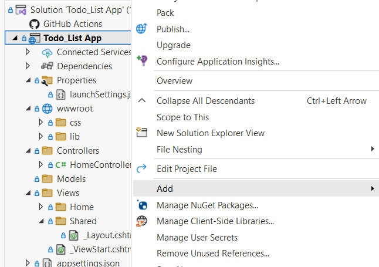
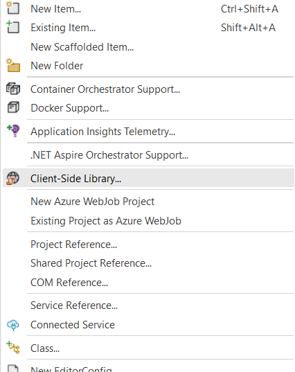
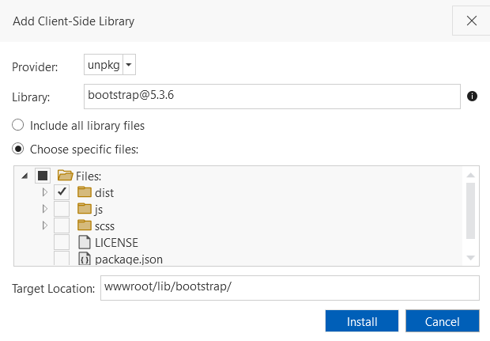

# 💻Local Offline Bootstrap Setup Guide in Visual Studio 2022

---

## ✅ Prerequisites

- ✅ Visual Studio 2022 installed
- ✅ .NET 8.0 or .NET 9.0 SDK installed

---

## 🛠️ Setup Instructions

### 1. Right-click on your project, go to Add, and select Client-Side Library.



---

### 2. Next, click Client-Side Library, select the dist folder only, and then install.



---

<br>

### 3. Once the installation is complete, add this to your _Layout.cshtml. 
<br>

```html
<link rel="stylesheet" href="lib/bootstrap/dist/css/bootstrap.css" asp-append-version="true" />


<script src="lib/bootstrap/dist/js/bootstrap.min.js"></script>
```
<br>
<br>
<br>
<br>
<br>
<br>
<br>
<br>
<br>
<br>
<br>
<br>
Made with ❤️ by John Joshua Manalo Escarez


